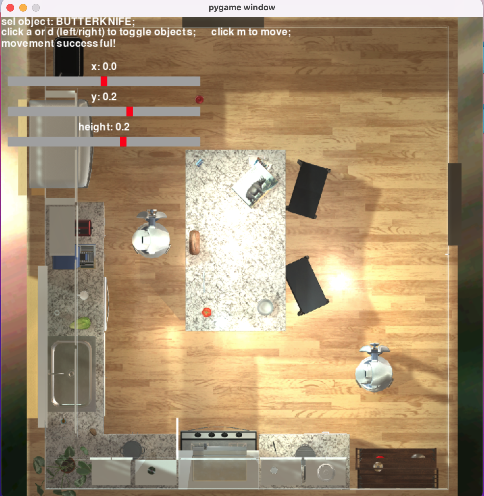

## How to create new tasks & pre-initializations

### To create a new task, you will need to know:

- Task description
- Applicable floorplans
  - To find these, check out the layout of each floorplan at https://ai2thor.allenai.org/demo/.

### Creating the pre-initializations for every floorplan that you wish to apply the task to.

For each floorplan:

- Create a json file with the following structure (fill in as appropriate):

  ```json
  {
    "floorplan": "FloorPlan1",
    "task_folder": "1_close_all_cabinets",
    "task_type": "manipulation",
    "task_complexity": "simple",
    "no_movement": false,
    "actions": { "OpenObject": ["Cabinet"] },
    "docs": "Opened all cabinets in the pre-initialization"
  }
  ```

  - **"task_folder"** : The name of the folder to put the task as. This must align with the name on the config.json file in the directory above this.
    We follow the convention of {complexity*number}*{name} where the complexity number corresponds to the task difficulty as described in MAP-Thor.
  - **"task_type"** : The type of task (transport, manipulation, etc).
  - **"task complexity"** : The level of difficulty.
  - **"no_movement"** : Set to true if no re-positioning of the objects is required.
  - **"actions"** : Create a dictionary with keys being the action to perform (following AI2Thor formatting), and values being lists of objects to apply it to.
    Call each object by a string contained in their ids (e.g. apple, tomato, switch) with proper capitalization. Give empty dictionary if no actions are necessary.\
     Note that is exclusive (i.e. knife is not butterknife).
  - **"docs"** : Quick description of what was done in pre-initialization to add to the pre-initialization file.

- Once that json file is filled, it is time to move the objects for the pre-initialization as necessary using the interactive visual interface.\
  Even if no movement is necessary, you should run this script (it'll just close and create the pre-init automatically).

  ```python
  # provide the json filename created just now, and the floorplan you wish to edit/preinit as argument
  # NOTE: run this script from the top directory only, NOT this one
  sudo python init_maker_easy/game.py --json="close_cabinets" --floorplan="FloorPlan2"
  ```

  #### Interactive Simulation

  If object movement is required, an interactive simulation will appear. Read the instructions below to learn how to move around the objects:

  - **Toggle between objects** using keys _'a'_ and _'d'_, for left and right respectively (shifts through array of all objects).
  - Using the sliders, **slide the x, y, and height** to values between -1 and 1.\
    The sign means direction, the magnitude means proportion (e.g. .2 in height means move 20% of the room's height upwards).\
    NOTE: the x, y directions might not represent the x, y axis due randomization by AI2Thor of frame orientation.
  - **Press _'m'_ to move the object** by the values in the sliders (relative to current position).

  <p align="center">
   
  </p>

  After you're finished, simply exit the window.\
  The pre-init file will be created in the "inits" folder (all .py files for the floorplans will be inside the folder name you provided in the json file)

#### Final Steps

Once you do this for all the applicable tasks, simply copy the folder inside the `inits` folder that contains all the pre-inits onto `AI2Thor/Tasks` on the top directory.

In that same directory, you should edit the task_mapper.py as appropriate.\
Additionally, in that directory, you should create a checker.py file as appropriate (see `AI2Thor/1_put_bread_lettuce_tomato_fridge/checker.py` as example from top directory).

Finally, edit the `configs/config_type<task_type>.json` file to incorporate that new task. This will allow automation when running experiments.
